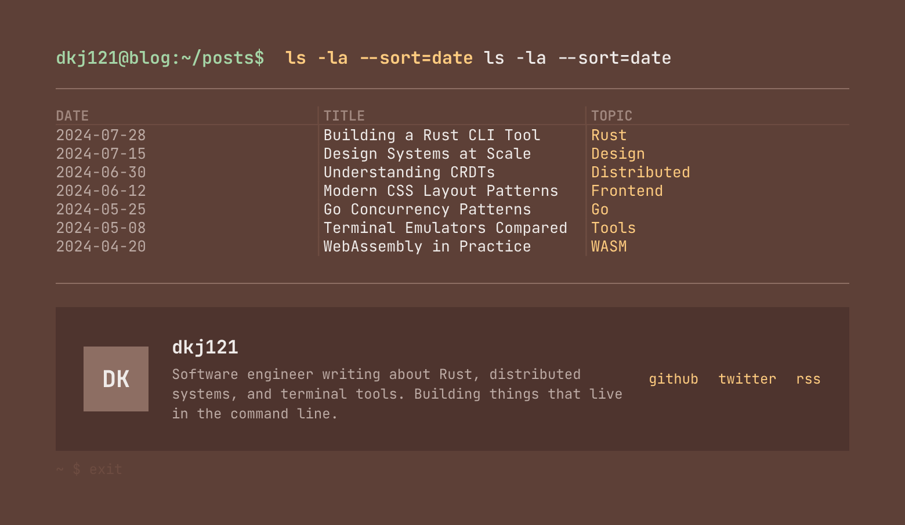

# dkj121.github.io



dkj121`s blog with brown teminal style

```txt

文件结构

dkj121.github.io
├─📂app/
│ ├── layout.tsx          主要布局
│ ├── page.tsx            Home 页面
│ ├── globals.css         Theme, fonts
│ └── 📂posts/[slug]/
│     └── page.tsx        单独的博客页面
├─📂components/
│ ├── post-list.tsx       博客列表组件
│ ├── post-content.tsx    博客内容组件
│ └── profile-footer.tsx  简介 card
├─📂content/posts/        .mdx blog
└─📂lib/posts.ts          MDX 转化工具

```
