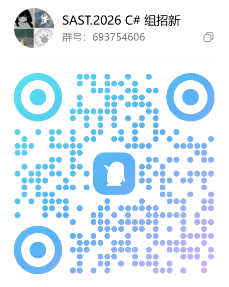
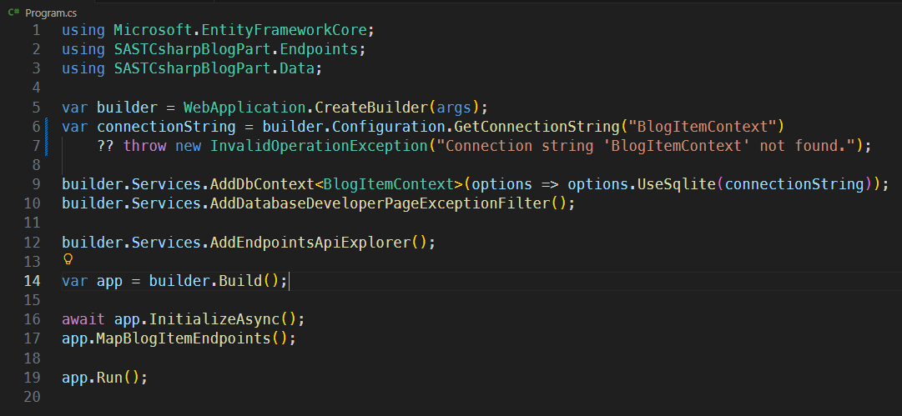
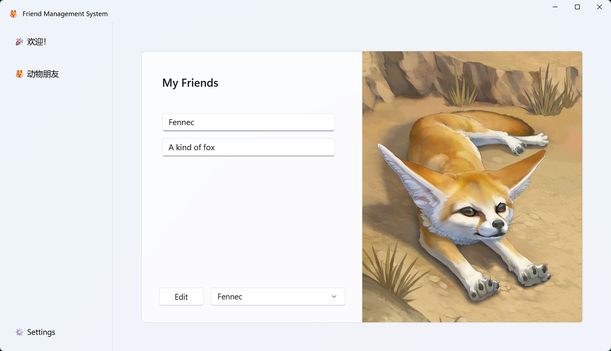

## 一、写在所有之前

免试题作为入住校科协的路径之一，最主要的目的就是为了吸收入学之前拥有项目经验或者对个人能力有信心的同学。

由此，我们不建议零基础小白死磕免试题，但是~~个人~~鼓励小白把免试题作为后期留任校科协的一个最低技术限度。

至此我们希望，完成这份免试题的同学可以达到以及超过我们这些老东西的水平，早日给我们带来年轻人的惊喜。

> 这里推销一下老东西手搓的一套入门C\#/\.NET笔记
> [安装你的第一套 \.NET 环境](https://njupt-sast.feishu.cn/wiki/Xt2SwNuHNiRxVzkTzhZcpwROnIf?renamingWikiNode=true)
> [ASP\.NET Core Docs](https://njupt-sast.feishu.cn/wiki/Z8kmwa4KkirKBckaV40cvZpxnGb?renamingWikiNode=true)
> 但是很遗憾的是，对于以上两份笔记，里面的大多数内容不过是微软原文档~~的精简翻译和口语化表达~~
> 以及更早学长的一些文章
> [Getting started](https://njupt-sast.feishu.cn/wiki/If22wpjiuiGzsikWi9YcCpE1nJd?renamingWikiNode=true)
> [WinUI 3: Getting Started](https://njupt-sast.feishu.cn/wiki/Zy59wXUnjinmTWkTA49cIyTqnrb?renamingWikiNode=true)

如果你对校科协、软研部以及C\#组不甚了解，请先阅读以下文档：

[欢迎来到校科协](https://njupt-sast.feishu.cn/wiki/TbcJwtET4iCBweks34ycGSyonze)

[软件研发部 介绍](https://njupt-sast.feishu.cn/wiki/DWQEwaAfTiTlrIkT6S5cdiQnnOd)

[C\# Group Introduction \- OnePage](https://njupt-sast.feishu.cn/wiki/VJgSwoHE5i1OjvkMM34cibSGnYg)

飞书群：[群链接](https://applink.feishu.cn/client/chat/chatter/add_by_link?link_token=bb3rebd9-168d-484e-b246-7b18152ce1e3)

QQ群：[693754606](https://qm.qq.com/q/Awr1fXa7cY)

**Also try Unity\!**[2026游戏开发与设计组免试题](https://njupt-sast.feishu.cn/wiki/JlF7wH8tdibjONkPACacm1Fpnfd)

## **二、导入**

同[前一届免试题](https://njupt-sast.feishu.cn/wiki/JpR6weWPriWfiekYfFPcTl7Rnog)基本一致，我们打算采用Web开发、桌面应用开发两套形式来检验来参加免试题面试的同学。

不同的是，基于 AI 造成的各种冲击，我们将不再注重考题内容，而是注重你的做题态度和面试时给我们展现出来的水平。

我们希望你能够 **Fork** 我们提供的项目代码到你自己的仓库里完成工作，并及时提交 **PR**（以便于我们即时查看你们的完成情况/doge

包括但不限于：

1. 项目管理水平（主要参考项目结构以及你对整个项目的了解情况）

2. 代码质量（懂得都懂）

3. 工具使用能力（包括：智能体使用）

4. 对作答内容有关知识的了解水平

5. 知识索取能力

6. 人性化程度~~（这很重要）~~

7. ~~写了多少注释~~

我们不在乎你采用的是哪一套技术栈，我们只希望你能够做到有始有终。（这意味着，我们**甚至不强求你使用 C\# 这门语言**，只需要专注于你已经掌握的技术栈，并在此的基础上实现我们要求的功能即可）

## **三、考题**

考题同一层级，不分先后，可以按照个人习惯随便选择完成顺序

### **1、 Web开发方向**

这里有一份[极简的 Blog 的 API 代码](https://github.com/dkj121/SASTCSharpBlogPart)\~

目前这份 Blog 采用的是 Minimal API，假如你对其他类型的框架更熟悉的话也可以自行选择简单重构这个项目

至于样例 Blog 我们在 [blogs](https://github.com/dkj121/SASTCSharpBlogPart/tree/master/wwwroot/blogs) 中提供了一部分（均为 markdown 格式），你也可以自行上传自己喜欢的内容

注意：对于本套题目，我们最注重的部分正是 **用户或评论区功能** 的实现

#### **（1）基础要求**

- [ ] 在自己的电脑上完成数据库绑定（我们提供了一些基础数据在 [BlogSeeder\.cs](https://github.com/dkj121/SASTCSharpBlogPart/blob/master/Data/BlogSeeder.cs) 中）

- [ ] 给当前的 Blog API 添加测试（Swagger、REST Client 等均可）

- [ ] 添加一整套用户或评论区功能~~（我说俩都端上来吧）~~

- [ ] 为他搭建起一套前端！（允许 vibe coding~~，但是并不妨碍我们进行批斗~~）

#### **（2） 进阶要求**

- [ ] 为用户界面添加实时可视化数据

- [ ] 把数据库部署到云端（[neon](https://console.neon.tech/)、Azure DB、AWS、[阿里云](https://www.aliyun.com/)、[腾讯云](https://cloud.tencent.com/)甚至华为云均可）

- [ ] 部署这个 Blog（[vercel](https://vercel.com/)、[render](https://render.com/)、github pages、cloudflare、Azure Web App、AWS、[阿里云](https://www.aliyun.com/)、[腾讯云](https://cloud.tencent.com/)甚至华为云均可）

- [ ] 为实现的所有功能添加覆盖面全的单元测试

#### **（3）开放内容**

1. 顺手尽可能美化一下你的前端

2. 添加一些你觉得可能用的到的功能

### **2、 桌面应用开发方向**

[这里有一群可爱的动物小伙伴](https://github.com/dkj121/SASTCSharpFriendPart)\~

目前这个项目还是仅仅只有最基本的登录/注册界面，我们希望你能够为当前的桌面端 APP 添加供小动物们沟通交流的交流界面。（参考 朋友圈、QQ 空间、微博、Twitter~~（现 X ）~~、Discard 等均可）

目前这个项目采用的是 WinUI3 框架，对于 MacOS 或者 Linux用户来说不够友好，如果需要，你也可以选择其他框架如 \.NET MAUI、React Native、[Electron](https://www.electronjs.org/)、Avalonia 等均可

注意：对于本套题目，我们最注重的部分正是 **桌面 APP** 的实现

#### **（1）基础要求**

- [ ] 在自己的电脑上完成数据绑定（目前本项目仅仅和 Core 中的 [data](https://github.com/dkj121/SASTCSharpFriendPart/blob/master/SASTCSharpFriendPart.Core/Data/data.json) 保持同步）

- [ ] 为当前应用搭建出一套聊天交流界面

- [ ] 为当前应用搭建出一套用户个人界面

#### **（2）进阶要求**

对于本套题目，我们同时还搭建了一套[远程 Service ](https://github.com/dkj121/SASTCSharpFriendPartService)用来负责信息同步，在这里，我们希望你能够完成远程数据绑定，并实现各自桌面端之间的同步

目前这份 Service 采用的是 Minimal API，假如你对其他类型的框架更熟悉的话也可以自行选择简单重构这个项目

- [ ] 自行部署远程服务（[vercel](https://vercel.com/)、[render](https://render.com/)、Azure Web App、AWS、[阿里云](https://www.aliyun.com/)、[腾讯云](https://cloud.tencent.com/)甚至华为云均可）

- [ ] 完成与远程数据之间的通信

- [ ] 为添加一套单元测试

#### **（3）开放内容**

1. 添加语音聊天功能！

2. 顺手尽可能美化一下你的前端

3. 添加其他你觉得可能用得到的功能

## **四、注意事项**

1. 开卷考试，允许使用 AI 辅助作答，但是不建议全盘梭哈（除非你能清楚地明白 AI 做了什么）

2. 考试期限：不设置期限，**不论是外部新人，还是内部老登**，我们都欢迎你参与 C\# 组免试题，一定要 **Fork** 并提交 **PR** 啊！

## 五、更多详细内容请参考

[2026SASTCsharp组免试题指北](https://njupt-sast.feishu.cn/wiki/ApSNwVEFbix5gPkjVODcoROQnac)

[版本控制与 Git 初识与 Github](https://njupt-sast.feishu.cn/wiki/QSeMwc7LViDcSbkxSlScC5AUn3f)

[Understand\-Anything](https://github.com/Egonex-AI/Understand-Anything) 一套 Claude Code 原生的项目=\>图谱 plugin
