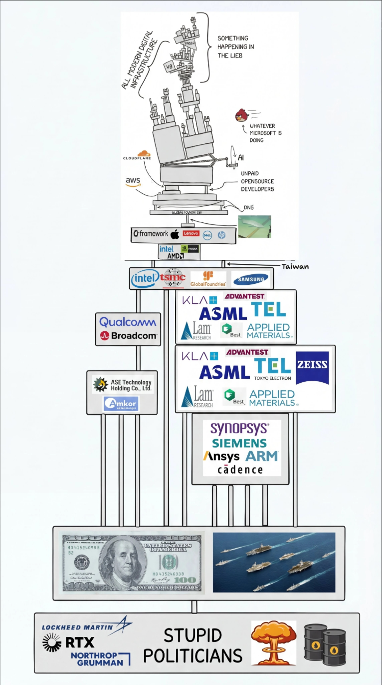

## 一、导入

前端开发总是绕不开设计，AI 背景下开发又被进一步弱化，就此前端似乎只剩下了设计。

最早期的设计离不开设计软件，例如 Photoshop，mcp 时期 figma、pencil 横空出世，近期伴随着 claude 推出了 artifacts 他试图将所有设计统一成一个 markdown 文件或者一个 html 静态界面（或者说我们现在试图在开发过程中保留的所有文档都可以视作 artifacts）

一切皆文件，markdown 文件作为一个中间层，串通设计者、开发者与 AI，而对于 PPT/Word/PDF 等等，像 Claude 团队做出了 Connecter、大多数相关软件提供了 mcp/cli/skills 等等，双向对接，一边是 AI 集成现有应用，另一边是将现有应用融入 AI 生态。

> ~~对于开发者来说只要见识过 HTML 的魔力之后，或许这些文件格式也会烟消云散(?)~~

## 二、设计

> 软件开发需要设计，好的设计理念经久不衰

架构设计/接口设计/前端设计/最初的功能设计，这些更多还是由人类主导的部分，但是在设计过程中与 AI 交换意见如今早已必不可少，最近甚至专门造了一个专有名词 GDD（Grill-Driven-Design）拷问驱动设计，本质就是强制开发者去和 AI 对话，明确设计细节。

之后的微调，很多时候还是依靠人工干预，AI 总结/落实，最明显的部分便是前端设计，想让 AI 一次性设计出有品位，高质量的前端是不可能的，最后设计师总要想法设法的进行微调）

> 美术方面常说的缺少灵魂？

这时 Claude Tag 也就是 @Claude 成为了更加便捷的选择，就像 Claude Design 那样，做出微调，不需要特定的对话窗口，直接右键 --> @Claude 随时随地展开问答，显得更加人性化且高效（或许 mcp 也应该这么做？但是不得不说，右键菜单简直就是普通电脑用户的福音）

## 三、迭代

不管是设计流程还是实现过程从来都是逐渐工程化的，现代软件由于巨大的历史包袱与庞大的应用群体，想要从头回炉重构显然是不太可能了，况且 AI 由建立在这之上，我们能做的，只有迭代与更清晰的设计吧
