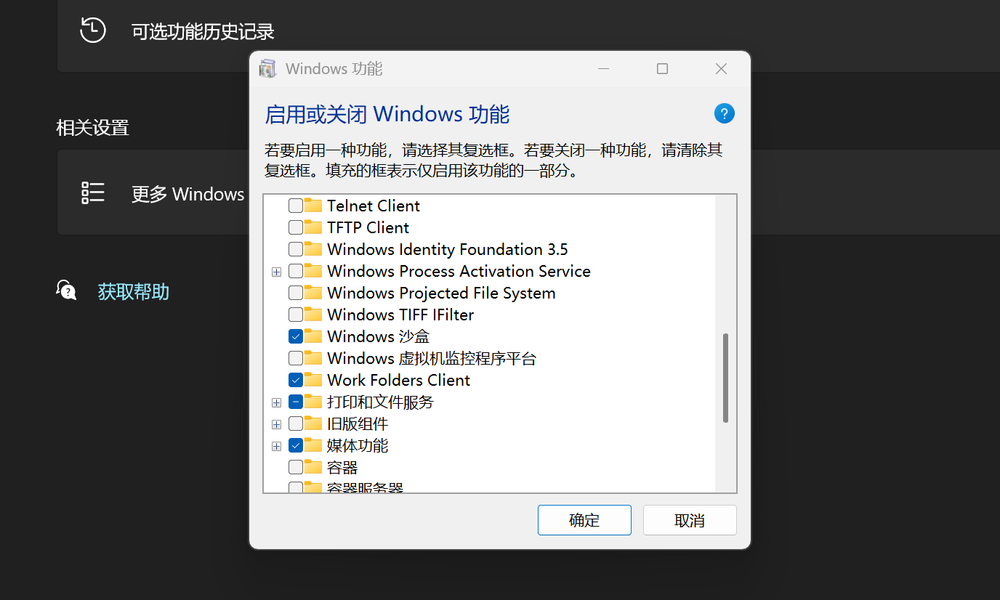
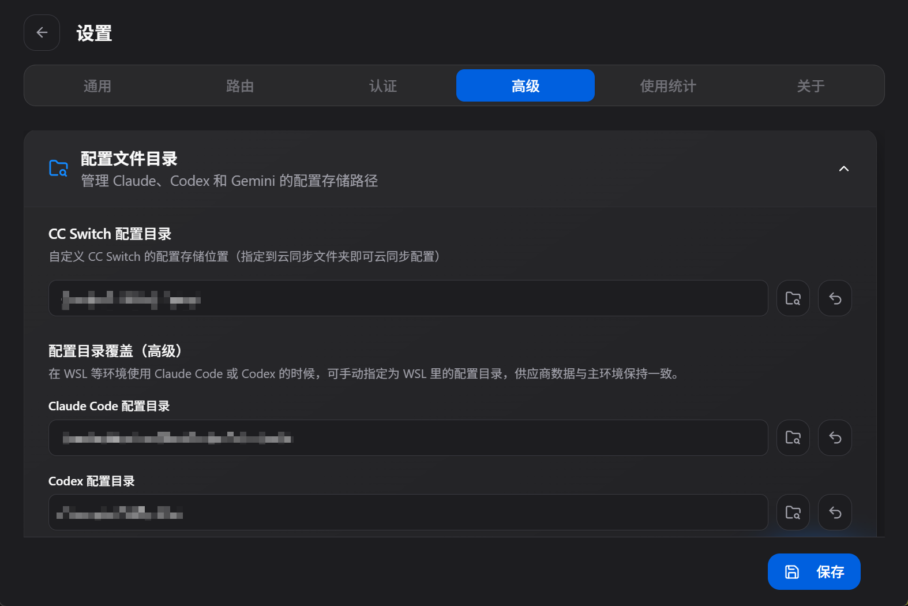
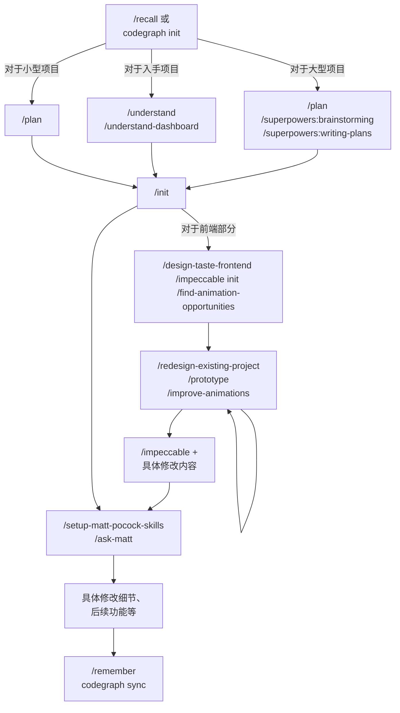

## 何为最佳实践

翻阅大量技术官网、技术博客、技术论坛，甚至是技术书籍，他们都会给出一些最佳实践的遵循。

## 何为 vibecoding

> vibe 情景式 coding 编码

自从[OpenAI](https://openai.com/) 发布了 ChatGPT 之后，AI 编程助手的概念就被广泛传播开来。

> 谁不想往死里薅微软的羊毛呢

自从 GitHub Copilot 全面接入微软编程生态，大量原本交给 [LSP](https://microsoft.github.io/language-server-protocol/) 的编程辅助功能被 AI 取代，甚至是超越。

至于 2026 年初，大量的专精 coding 的 agent 也被开发出来，逐步进入大众实现，以至于普通人也能轻而易举的实现自己的一些小工具。

## 工具推荐

> 大多是我自己在使用的工具，当然也有一些是我觉得不错的工具，仅供参考。

### 1.[Visual Studio Code](https://code.visualstudio.com/)

自从 [v1.127](https://code.visualstudio.com/updates/v1_127) 版本之后，vscode 也支持了类似于 [trea](https://www.trae.ai/)、[codex](https://openai.com/zh-Hans-CN/codex/) 的 AI 编程界面。

它的插件生态，对于大多数编程语言，它都提供了非常完善的插件支持，甚至是对于一些冷门的编程语言，也有一些社区开发的插件。

### 2.[Codex(现 ChatGPT)](https://openai.com/zh-Hans-CN/codex/)

作为现代 AI 编程的鼻祖，Codex 的出现让编程变得更加简单。无论是对于初学者还是对于专业开发者，Codex 都提供了非常强大的支持。

同时 Codex 的沙箱式设计为开发者提供了一个安全的编程环境，让开发者可以在不影响现有代码的情况下进行实验和测试。

> 这时，对于 Windows 用户需要提前启动 Windows Sandbox 服务，详情请参考：https://learn.chatgpt.com/docs/windows/windows-sandbox
> 对于 WSL2 用户则需要提前在其中安装 `bubblewrap`（通常默认安装）
> 

### 3.[Claude Code](https://claude.com/product/claude-code)

[auto mode](https://code.claude.com/docs/en/glossary#auto-mode) 实现绝大多数项目的不二之选，不管是对于工程设计、细节优化、错误处理都是断档式的存在。

配合本家 [Claude](https://claude.com/product/overview) 全家桶几乎无懈可击（

### 4.[CC-Switch](https://ccswitch.io/zh/)

> 一站式统一管理所有 AI 工具，本质上是通过修改配置文件来完成。

提供了不只是 Agent 配置的统一管理，还对 Agent 调用的 skill、prompt、history、mcp 等进行了统一管理，甚至是对不同的 Agent 进行了统一的调用。

> 对于 WSL 用户则可以通过设置中的高级设置自定义管理目录，同时这里建议将 skills 的绑定模式改为`文件复制`，以提高读取小文件的效率
> 

### 5.[skills](https://www.skills.sh/)

统一管理本地所有 skills，cc-switch 内置，同时其官网实时提供了大量的受欢迎的 skills

### 6.[codegraph](https://github.com/colbymchenry/codegraph)

代码 -> db，同时提供了 skill、hooks、mcp 减少 ai 反复确认项目架构的过程（实际上更推荐直接启用 agent 内部的指定文件功能）

## 一些 extension

> 除了以下内容 claude code 官方也提供了大量[优秀的拓展](https://github.com/anthropics/claude-plugins-official)、[skills](https://github.com/anthropics/skills)

|                               Extensions                                |                                  简介                                  |
| :---------------------------------------------------------------------: | :--------------------------------------------------------------------: |
|           [superpowers](https://github.com/obra/superpowers)            |                    claude code 严父，专攻于项目构建                    |
|         [agentmemory](https://github.com/rohitg00/agentmemory)          |           负责储存 agent 的记忆，并且支持引入 agent 单独管理           |
| [codebase-memory-mcp](https://github.com/DeusData/codebase-memory-mcp)  | 用于形成代码图谱，将多个文件之间的关系进行可视化，便于 agent 进行调用  |
|             [skills](https://github.com/mattpocock/skills)              | 由软件工程师 Matt Pocock 自我蒸馏而成的一组适配于整个开发流程的 skills |
|         [taste-skill](https://github.com/Leonxlnx/taste-skill)          |    前端严父，专攻于前端开发，专门适配了 gpt-taste 来强化 codex 开发    |
|            [skills](https://github.com/emilkowalski/skills)             |                      一组专注于 UI 动画的 skills                       |
|           [impeccable](https://github.com/pbakaus/impeccable)           |        与上一个类似，相较而言，提供了一套工作流，便于进一步调试        |
| [Understand-Anything](https://github.com/Egonex-AI/Understand-Anything) | 一套方便开发者（或者 ai ）快速入门一个仓库的一组插件 claude code 原生  |

> 尽管当前大多数 ai 能够自主的调用大部分拓展，但是这里依然还是建议开发者在开发过程中主动声明已有的拓展，以便于 ai 进行更好的调用。

## Quickly Start (normal)

1. 对于大型项目，建议使用 `/plan /superpowers:brainstorming /superpowers:writing-plans` 来进行项目的整体规划，尽可能详尽的阐述项目架构、技术实现、项目内容。
2. 不要一次性输入多个可能改变 agent 角色的 `/prompt`，尽可能的将每一个 prompt 的内容拆分开来或者使用 `/superpowers:dispatching-parallel-agents` 拆分没有关联的任务，避免 ai 过度记忆导致的混乱（对于适用于一组工作流的可以尝试，但是依旧尽量避免）
3. 对于每一处特定函数修改，强调使用 `/codebase-memory`
4. 对于前端修改，先利用 [figma](https://www.figma.com/)、[pen](https://www.pen.dev/)、[penpot](https://penpot.app/) 等工具先生成样例文件，待最终确定后再开始编码
5. 对于体系分明的项目，适当使用 `/skill-creator` 等 skill 生成指令或者使用 `/find-skill`来生成或找到对应的 skill
6. 即时覆写 ai 写好的 plan 文件
7. 提供/生成合适的 CI/CD/workflows 供 ai 规范流程

> 下图省略描述词，仅提供对应指令（同时代替具体内容），仅供参考（frontend first）
> 此外，对于多 agents 并行，claude code 采用了新的策略 [agent team](https://code.claude.com/docs/en/agents) 来适配大型项目

## 总结

> 有了约束，速度才不会下降，架构才不会漂移。 ———— OpenAI

“设计环境、反馈回路和控制系统” 这是 OpenAI 在 2026 年初提出的一套 ai-engineering 对人类而言需要解决的核心问题。

ai 本质上作为一个使用工具的工具，每一次对话都是在从头构建一套工具包，在每一次对话都是在为当前项目设计一套工具包。

对于小玩具来说或许没必要如此讲究，但是对大多数人来说，不光是为了提高效率，更是为了在未来的开发中，能够更好的适应 ai 的发展。
